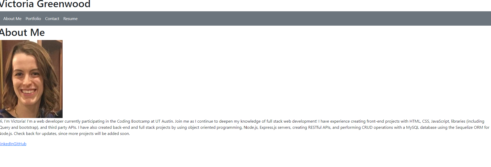

# React-Developer-Portfolio

## Description

This project demonstrates use of React to build a single plage application and practice using React concepts like components, props, and react router. The project also uses Vite to configure the applicatio with hot module replacement.

## Installation

Clone the repository, then run the command "npm run dev' to run the app locally with vite.

## Usage

Click the links in the navbar to see the different parts of the portfolio. 

    

## Credits

References:

Class Activities/Lecture:
Reference for file structure of the app

Xpert AI:
Debugging react router error with importing file paths

Microsoft copilot:

Reference for how to import and render photos using react and JSX syntax

React tutorial for rendering lists/map method used in portfolio:

Net Ninja. (2020, December 31). Full React Tutorial #10 - Outputting Lists. YouTube. Retrieved June 10, 2024, from https://www.youtube.com/watch?v=tHjxSVaj_wY

React tutorial for use of props:
Net Ninja. (2021, January 4). Full React Tutorial #11 - Props. YouTube. Retrieved June 10, 2024, from https://www.youtube.com/watch?v=PHaECbrKgs0

## License

This project uses an MIT license that can be found in the LICENSE file of the repository, or to learn more visit https://choosealicense.com/licenses/mit/
